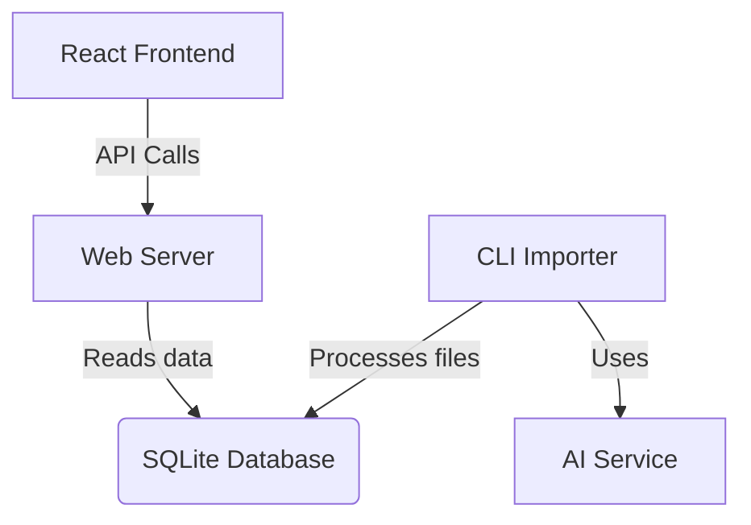

# Budget Assist - System Design Overview

## Introduction
Budget Assist is a financial management system designed to help users track, categorize, and analyze their personal finances with a focus on the Swedish market.

## System Architecture

## Core Components
- **CLI Importer**: Processes financial documents and performs AI analysis
- **Web Server**: REST API + React frontend serving
- **AI Service**: Intelligent data extraction and categorization
- **Data Storage**: SQLite with gorm.io integration
- **Reporting Engine**: Financial insights and budget tracking

## Documentation Structure
1. [System Architecture](01-System-Architecture.md)
2. [Data Model](02-Data-Model.md)
3. [AI Integration](03-AI-Integration.md)
4. [API Design](04-API-Design.md)
5. [Security & Compliance](05-Security-Compliance.md)
6. [Development & Deployment](06-Development-Deployment.md)

## Key Features
- Intelligent transaction categorization
- Multi-property and multi-vehicle expense tracking
- Swedish market adaptations (VAT, bank integrations)
- Budget planning and monitoring
- Financial report generation 