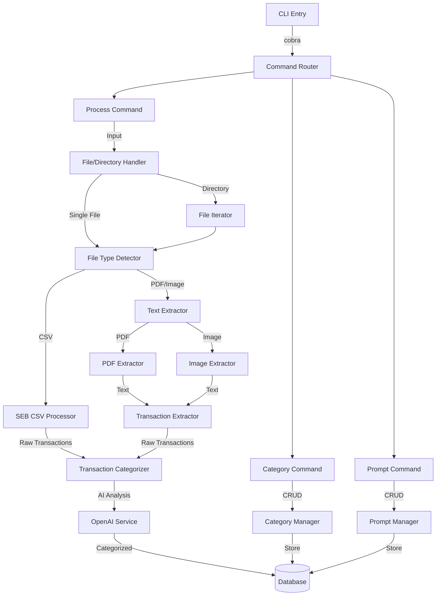
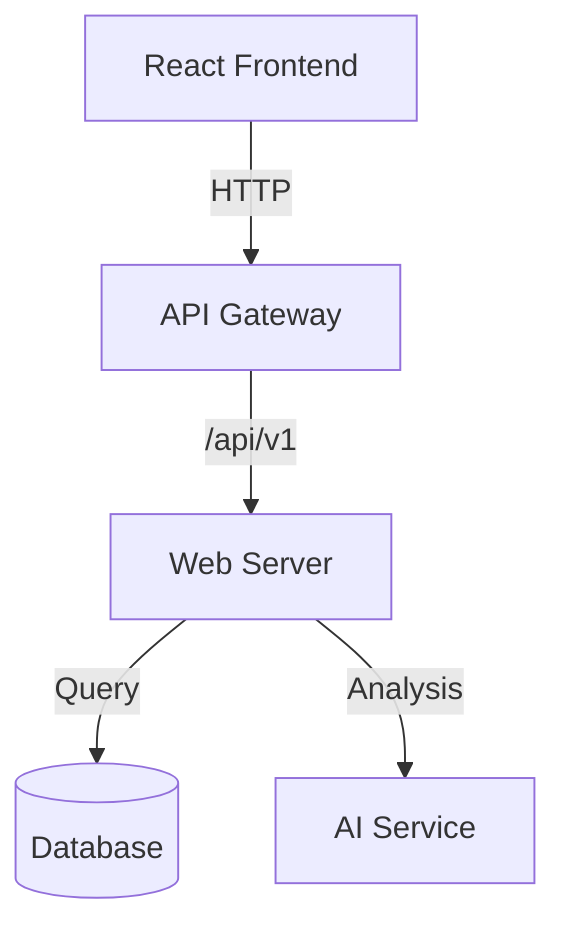

# System Architecture

## Component Overview

### CLI Application


### Web Application


## Component Details

### CLI Document Processing
```go
type DocumentProcessor interface {
    Process(ctx context.Context, path string, opts ProcessOptions) error
}

type ProcessOptions struct {
    DocumentType            string    // "bankstatement", "bill", "receipt"
    TransactionInsights    string    // Runtime insights for transaction extraction
    CategoryInsights       string    // Runtime insights for categorization
}

type FileHandler interface {
    CanHandle(path string) bool
    Process(ctx context.Context, path string, opts ProcessOptions) ([]Transaction, error)
}

type TextExtractor interface {
    Extract(ctx context.Context, path string) (string, error)
}

// Processing Pipeline Flow
// 1. Input validation (file/directory, document type)
// 2. For each file:
//    a. Detect file type (PDF, CSV, Image)
//    b. Extract text/data
//    c. If CSV and type=bankstatement:
//       - Parse using SEB format
//       - No AI needed for transaction extraction
//    d. If PDF/Image:
//       - Extract text
//       - Use AI with TransactionInsights to find transactions
// 3. For all transactions:
//    - Use AI with CategoryInsights to categorize
// 4. Store in database

// Supported file types
- PDF (bills, receipts)
- CSV (bank statements - SEB format)
- Images (PNG, JPG - receipts)

// Example CLI Usage
budget-assist process receipt.pdf --doc-type receipt \
    --transaction-insights "Items starting with 'REA' are discounts" \
    --category-insights "If store is 'ICA' categorize as Groceries"

budget-assist process ./statements --doc-type bankstatement \
    --category-insights "Transactions from 'SWISH' are transfers"
```

### Web Server
- **Framework**: Gin/Echo
- **Architecture**: Clean Architecture pattern
- **Layers**:
  - Handlers (API endpoints)
  - Services (Business logic)
  - Repositories (Data access)

### Database Access
```go
type Repository interface {
    CreateTransaction(ctx context.Context, tx *Transaction) error
    GetTransactions(ctx context.Context, filter TransactionFilter) ([]Transaction, error)
    UpdateCategory(ctx context.Context, txID int64, cat CategoryUpdate) error
}
```

## Data Flow

### Import Flow
1. File detection & validation
2. Text/data extraction
3. AI analysis & categorization
4. Data normalization
5. Storage & indexing
6. Event notification

### Query Flow
1. API request validation
2. Permission checking
3. Data retrieval
4. Optional aggregation
5. Response formatting

## Configuration Management

### Environment Variables
```yaml
DATABASE_URL: sqlite:///data/budget.db
AI_SERVICE_URL: http://localhost:8080
AI_API_KEY: ${AI_KEY}
LOG_LEVEL: info
ENABLE_METRICS: true
```

### Feature Flags
```go
type Features struct {
    EnableAICategories bool
    EnableQRScanning   bool
    EnableBankSync     bool
    EnableNotifications bool
}
``` 