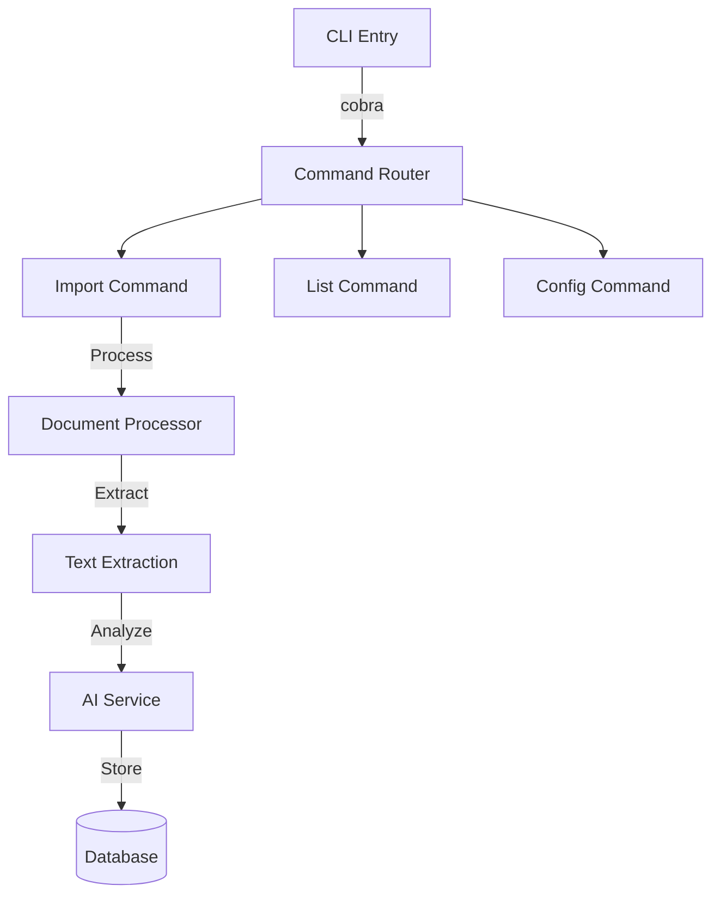
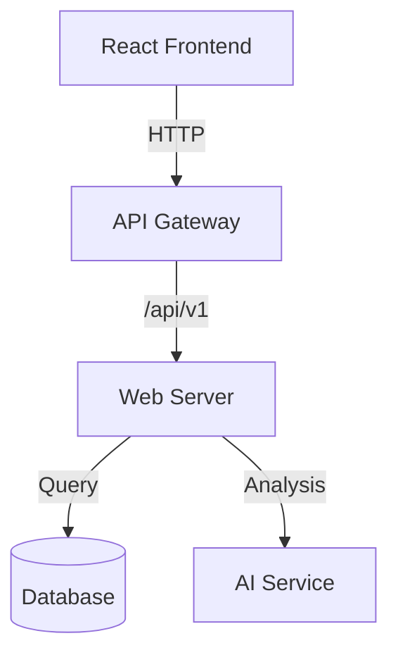

# System Architecture

## Component Overview

### CLI Application


### Web Application


## Component Details

### CLI Importer
```go
type DocumentProcessor struct {
    aiService    ai.Service
    db           *gorm.DB
    fileHandlers map[string]FileHandler
}

type FileHandler interface {
    CanHandle(filename string) bool
    Extract(ctx context.Context, path string) ([]Transaction, error)
}

// Supported file types
- PDF (bank statements, invoices)
- CSV (exported transactions)
- QR codes (Swedish invoices)
- Images (receipts)
```

### Web Server
- **Framework**: Gin/Echo
- **Architecture**: Clean Architecture pattern
- **Layers**:
  - Handlers (API endpoints)
  - Services (Business logic)
  - Repositories (Data access)

### Database Access
```go
type Repository interface {
    CreateTransaction(ctx context.Context, tx *Transaction) error
    GetTransactions(ctx context.Context, filter TransactionFilter) ([]Transaction, error)
    UpdateCategory(ctx context.Context, txID int64, cat CategoryUpdate) error
}
```

## Data Flow

### Import Flow
1. File detection & validation
2. Text/data extraction
3. AI analysis & categorization
4. Data normalization
5. Storage & indexing
6. Event notification

### Query Flow
1. API request validation
2. Permission checking
3. Data retrieval
4. Optional aggregation
5. Response formatting

## Configuration Management

### Environment Variables
```yaml
DATABASE_URL: sqlite:///data/budget.db
AI_SERVICE_URL: http://localhost:8080
AI_API_KEY: ${AI_KEY}
LOG_LEVEL: info
ENABLE_METRICS: true
```

### Feature Flags
```go
type Features struct {
    EnableAICategories bool
    EnableQRScanning   bool
    EnableBankSync     bool
    EnableNotifications bool
}
``` 