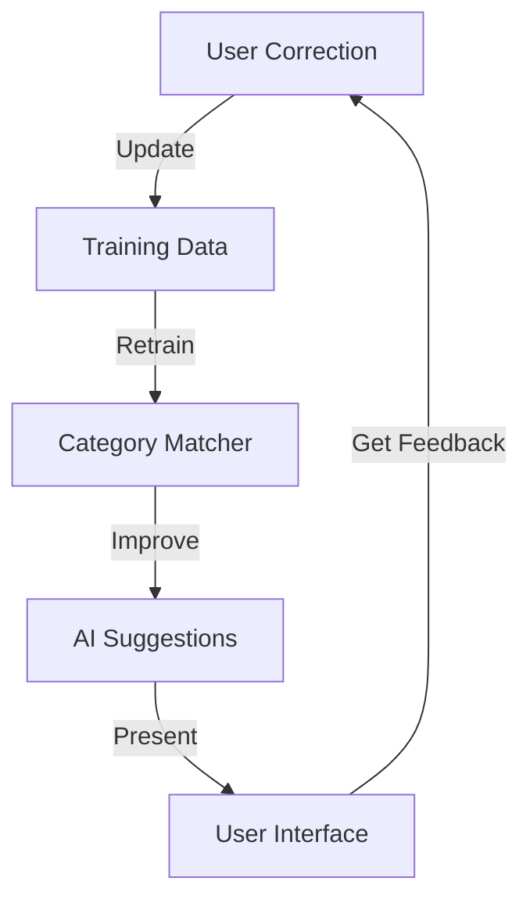

# AI Integration Design

## Overview
The AI system assists in categorizing transactions and extracting information from documents using Large Language Models (LLMs).

## AI Service Interface

```go
type AIService interface {
    AnalyzeTransaction(ctx context.Context, req AnalysisRequest) (*AnalysisResponse, error)
    ExtractDocument(ctx context.Context, doc DocumentData) (*ExtractionResult, error)
    SuggestCategories(ctx context.Context, description string) ([]CategorySuggestion, error)
}

type AnalysisRequest struct {
    RawText        string
    Amount         float64
    Date           time.Time
    ExistingData   map[string]interface{}
    UserPreferences UserPrefs
}

type AnalysisResponse struct {
    Category       CategoryMatch
    Confidence     float64
    Metadata       map[string]interface{}
    Suggestions    []Alternative
}
```

## LLM Integration

### Prompt Templates
```go
const TransactionPrompt = `
Analyze this transaction and categorize according to Swedish budget categories:

Transaction: {{.Description}}
Amount: {{.Amount}} {{.Currency}}
Date: {{.Date}}

Available categories:
{{range .Categories}}
- {{.Name}} ({{.Description}})
{{end}}

Provide categorization with confidence score and reasoning.
`
```

### Category Training Data
```json
{
  "training_examples": [
    {
      "text": "PREEM STOCKHOLM",
      "category": "Fordon",
      "subcategory": "Drivmedel",
      "confidence": 0.95
    },
    {
      "text": "VATTENFALL AB",
      "category": "Bostad",
      "subcategory": "Hushållsel",
      "confidence": 0.98
    }
  ]
}
```

## AI Processing Pipeline

### Document Processing
1. Text extraction (OCR if needed)
2. Structure identification
3. Data extraction
4. Validation & confidence scoring
5. Human review queue if needed

### Transaction Analysis
1. Text normalization
2. Pattern matching
3. LLM categorization
4. Historical comparison
5. Confidence calculation

## Learning & Improvement

### Feedback Loop


### Performance Metrics
- Categorization accuracy
- Processing time
- Confidence correlation
- User correction rate
- Pattern recognition rate

## Error Handling

### AI Service Errors
```go
type AIError struct {
    Stage    string
    Message  string
    Details  map[string]interface{}
    Retryable bool
}

func (e *AIError) Error() string {
    return fmt.Sprintf("AI error at %s: %s", e.Stage, e.Message)
}
```

### Fallback Strategy
1. Pattern matching
2. Historical data
3. User prompt
4. Default categorization 